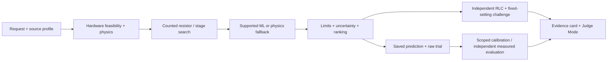

# ImpulseTwin AI

Physics-guided decision support for high-voltage impulse-generator setup. It recommends counted resistor/stage configurations before the next physical trial and makes the evidence, uncertainty and source assumptions inspectable.

The laboratory workflow often repeats analytical estimates, physical adjustments and trial shots. ImpulseTwin combines workbook physics, an independent RLC model, inventory constraints and synthetic residual learning to propose a defensible starting point. ML corrects systematic residuals only within supported calculator settings; otherwise the system falls back to physics.

## Architecture



[Architecture detail](docs/architecture.md) explains ownership and data flow. Post-ranking challenges do not rerank candidates.

## Evidence available

- **Synthetic benchmark:** frozen V1 reduced macro tolerance-normalized RMSE by 41.9265% versus physics on the original supplied Hidden Test. This is error reduction, not an accuracy percentage. Saved results are preserved; Hidden Test was not reused for tuning.
- **Development experiments:** V2 remains optional/experimental. V3, V4 and V5 remain non-promoted. Their development CV comparisons cannot be added to the V1 result. [Timeline](docs/experiment_timeline.md).
- **Search quality:** the bounded winner matches exhaustive enumeration in all four declared small synthetic cases, with zero objective gaps. This does not establish a global optimum. [Protocol and limits](docs/optimizer_quality_benchmark.md).
- **Generated trial feedback:** exercises upload, quality review and scoped calibration, always labeled as generated.
- **Measured laboratory accuracy:** pending actual independent captures. The [laboratory evidence workflow](docs/laboratory_evidence.md) is ready to accept and evaluate them without mixing sources.

## Important limits

Workbook 15-stage / 3 µF and PDF 12-stage / 0.125 µF profiles remain separate. Actual CPRI stock counts, pulse ratings, permitted mounting and the role of 545 pF need confirmation. Unknown inventory requires an explicit operator override. Equipment test levels are not invented when no authoritative catalog exists.

Reference and circuit predictions may disagree. Synthetic uncertainty and finite scenario checks do not guarantee laboratory performance. The workbook's static validation-table discrepancy remains unresolved. This software is decision support, not a hardware controller or IEC certification. [Source reconciliation](docs/source_reconciliation.md).

## Run locally

Use Python 3.12. Frozen models and the static UI are included, so training and Node are unnecessary to run the prepared app.

```sh
python -m venv .venv
# Activate .venv for your shell, then:
python -m pip install -r requirements.txt
python scripts/dev.py
```

Open **http://127.0.0.1:8000/judge/**. For exact Windows PowerShell, macOS and Linux installation/build commands, see [local setup and release readiness](docs/release_readiness.md). Setup needs internet for dependencies; inference runs locally after preparation.

## Demo and engineering views

**Judge Mode** guides a 4–6 minute tour: problem → request → exact configuration → evidence → alternatives → trial feedback → summary. Predictions and labels come from actual backend results. [Demo guide](docs/judge_mode.md).

Engineering pages retain waveform exploration, trial calibration, setup-change planning, model metrics, history and reports. New **Laboratory Evidence**, **Hardware Verification**, **Experiment Timeline** and **Search Quality** pages make the supporting evidence easier to inspect. [Evidence levels](docs/evidence_levels.md), [hardware provenance](docs/hardware_verification.md), [test-object references](docs/test_object_reference.md).

## Validate a release

```sh
python scripts/verify_release.py
```

The verifier checks frozen hashes, configuration/models, tests, frontend typecheck/build, static assets and a fresh database with external network blocked in-process. It writes `artifacts/release_readiness.json` with PASS / FAIL / NOT TESTED. Unverified platforms and disconnected-laptop rehearsal remain explicit.

No deployment is included. The next step is verified hardware metadata and independent measured laboratory captures. Original implementation history and deeper results are preserved in [project history](docs/project_history.md), [PROJECT_STATE.md](PROJECT_STATE.md), and [HANDOFF.md](HANDOFF.md).
