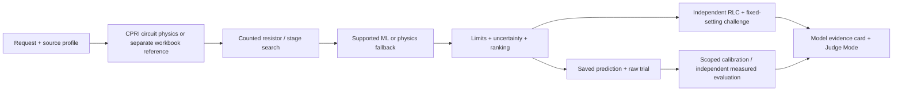

# ImpulseTwin AI

Physics-guided decision support for high-voltage impulse-generator setup. It recommends counted resistor/stage configurations before the next physical trial and makes the evidence, uncertainty and source assumptions inspectable.

The laboratory workflow often repeats analytical estimates, physical adjustments and trial shots. ImpulseTwin combines the CPRI physical generator profile, an explicit lumped Marx/RLC model and counted inventory constraints to propose a defensible starting point. The separate workbook profile supports reference reproduction and synthetic ML benchmarking. Frozen residual ML applies only to supported workbook calculator settings; it remains disabled for the CPRI profile and circuit mode.

The engineering UI and Judge Mode now start with the **CPRI physical profile and circuit physics**. Source stock quantities are unknown, so enter actual counts or a clearly labeled operator assumption before optimizing. The displayed load, divider, stray capacitance, inductance and efficiency are editable example inputs, not measured machine parameters. The 545 pF source capacitance is included explicitly and must be excluded if already represented by the divider/system inputs.

**Hardening verification:** final verification pending. The current change rationale, before/after checks and remaining limits will be recorded in [OPTIMIZATION_REPORT.md](OPTIMIZATION_REPORT.md) and `artifacts/optimization_report.json`. Earlier dated release reports remain historical evidence.

## Architecture



[Architecture detail](docs/architecture.md) explains ownership and data flow. Post-ranking challenges do not rerank candidates.

## Evidence available

- **Synthetic benchmark:** frozen V1 reduced macro tolerance-normalized RMSE by 41.9265% versus physics on the original supplied Hidden Test. This is error reduction, not an accuracy percentage. Saved results are preserved; Hidden Test was not reused for tuning.
- **Development experiments:** V2 remains optional/experimental. V3, V4 and V5 remain non-promoted. Their development CV comparisons cannot be added to the V1 result. [Timeline](docs/experiment_timeline.md).
- **Saved search-quality evidence:** the previous release's bounded winner matches exhaustive enumeration in all four declared small synthetic cases, with zero objective gaps. The current hardening comparison is recorded separately in the optimization report. These small cases do not establish a global optimum. [Protocol and limits](docs/optimizer_quality_benchmark.md).
- **Generated trial feedback:** exercises upload, quality review and scoped calibration, always labeled as generated.
- **Measured laboratory accuracy:** pending actual independent captures. The [laboratory evidence workflow](docs/laboratory_evidence.md) is ready to accept and evaluate them without mixing sources.

## Important limits

The organizer clarification supplied for this hardening identifies the problem-statement parameters as the actual/reference CPRI generator inputs: 12 maximum stages, 200 kV/stage, 0.125 µF/stage and 2.5 kJ/stage / 30 kJ total. The workbook's 15-stage / 3 µF synthetic reference remains separate. CPRI stock counts, pulse ratings, permitted mounting, physical minimum operating voltage/stages and the role of 545 pF remain unverified. The configured 50 kV and two-stage lower bounds are application assumptions. Unknown inventory requires an explicit operator override. Equipment test levels are not invented when no authoritative catalog exists.

Reference and circuit predictions may disagree. Synthetic uncertainty and finite scenario checks do not guarantee laboratory performance. The workbook's static validation-table discrepancy remains unresolved. This software is decision support, not a hardware controller or IEC certification. [Source reconciliation](docs/source_reconciliation.md).

Circuit **v2.1** keeps the same physical equations while stabilizing the zero-inductance analytic solution, retaining significant tiny inductance and refining fast crossings at an appropriate numerical tolerance. It returns an explicit diagnostic if continuous crest or decay modes cannot be resolved. The matched CPRI Lightning regression retains approximately 11 stages, 181.90 kV/stage, 1.187 µs front, 53.744 µs tail and 22.75 kJ stored charging energy. [Model assumptions and units](docs/assumptions.md).

## Run locally

Use Python 3.12. Frozen models and the static UI are included, so training and Node are unnecessary to run the prepared app.

```sh
python -m venv .venv
# Activate .venv for your shell, then:
python -m pip install -r requirements.txt
python scripts/dev.py
```

Open **http://127.0.0.1:8000/judge/**. For exact Windows PowerShell, macOS and Linux installation/build commands, see [local setup and release readiness](docs/release_readiness.md). Setup needs internet for dependencies; inference runs locally after preparation.

## Demo and engineering views

**Judge Mode** guides a 4–6 minute tour: problem → request → exact configuration → evidence → alternatives → trial feedback → summary. Predictions and labels come from actual backend results. [Demo guide](docs/judge_mode.md).

Engineering pages retain waveform exploration, trial calibration, setup-change planning, model metrics, history and reports. **Laboratory Evidence**, **Hardware Verification**, **Experiment Timeline** and **Search Quality** make the supporting evidence easier to inspect. [Evidence levels](docs/evidence_levels.md), [hardware provenance](docs/hardware_verification.md), [test-object references](docs/test_object_reference.md).

The 6 October hardening passes 263 backend tests, frontend checks and desktop/mobile browser review while preserving frozen evidence. Before/after timings, search comparisons, numerical corrections and remaining limits are in [the optimization report](OPTIMIZATION_REPORT.md); progress is recorded in [AGENTS.md](AGENTS.md).

## Validate a release

```sh
python scripts/verify_release.py
```

The verifier checks frozen hashes, configuration/models, tests, frontend typecheck/build, static assets and a fresh database with external network blocked in-process. It writes `artifacts/release_readiness.json` with PASS / FAIL / NOT TESTED. Unverified platforms and disconnected-laptop rehearsal remain explicit.

No deployment is included. Confirm the remaining hardware metadata for physical application. Independent measured captures can later establish laboratory performance; they are not a prerequisite for the current physics-based challenge solution. Original implementation history and deeper results are preserved in [project history](docs/project_history.md), [PROJECT_STATE.md](PROJECT_STATE.md), and [HANDOFF.md](HANDOFF.md).
