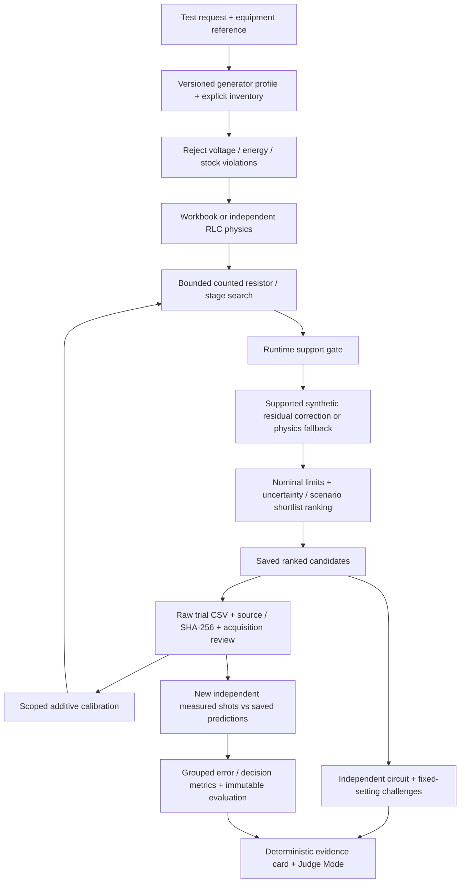

# Architecture

`backend/app/optimization/engine.py` owns feasibility, inference integration and ranking; the post-ranking verification never changes the ordering. `physics/` owns circuit/compliance/extraction. `ml/registry.py` loads frozen artifacts and gates correction. `storage.py` retains immutable local JSON records in SQLite; `IMPULSETWIN_DB` selects a different history.

`trial_provenance.py`, `trial_quality.py`, `trial_evaluation.py` and `evidence.py` separate origin, admission quality, independent scoring and presentation. `test_objects.py` checks catalog/operator references independently of generator capability. `hardware_integrity.py` presents source confidence without claiming verified hardware.

Next.js exports local assets served by FastAPI. Existing engineering screens and Judge Mode share one workspace and API. Timeline/search pages read executed artifacts; they never retrain in a request. Reports retain the original detailed engineering path. Release verification checks protected hashes, configuration/model consistency, automated tests, assets and a fresh isolated database with external network blocked.
