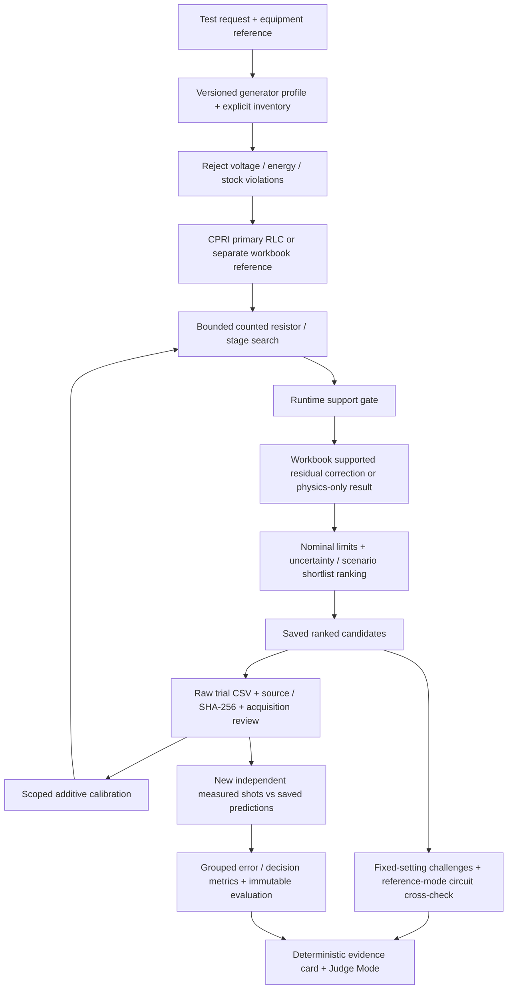

# Architecture

`backend/app/optimization/engine.py` owns feasibility, inference integration and ranking; the post-ranking verification never changes the ordering. `physics/` owns circuit/compliance/extraction. `ml/registry.py` loads frozen artifacts and gates correction. `storage.py` retains immutable local JSON records in SQLite; `IMPULSETWIN_DB` selects a different history.

The engineering UI and Judge Mode start with `cpri_problem_brief_profile`, the circuit solver and physics-only prediction. CPRI's supplied 12-stage / 0.125 µF physical profile is the primary engineering reference. Its stock counts are not supplied, so the request must provide counted inventory and provenance. Example load/parasitic/efficiency inputs remain operator assumptions. The optional 545 pF contribution enters total capacitance once and can be excluded when already accounted for elsewhere.

`workbook_reference_profile` remains a separate 15-stage / 3 µF mathematical reference and synthetic benchmark. Only its reference-solver path can use frozen V1 residual correction after the backend support gate. Circuit mode and the CPRI profile use physics-only output. Selecting a profile updates UI solver wording and defaults; the backend remains the source of engineering results. No profile borrows missing parameters from another.

The circuit's v2.1 numerical policy retains the same nodal topology. It computes zero-inductance RC modes and peak analytically, uses a dimensionless check before neglecting tiny positive inductance, and scales crossing-root tolerance for fast circuits. An unresolved continuous crest or finite stable decay mode produces a diagnostic failure. A solver-version change prevents an older scoped calibration from transferring automatically. [Equations, units and remaining assumptions](assumptions.md).

`trial_provenance.py`, `trial_quality.py`, `trial_evaluation.py` and `evidence.py` separate origin, admission quality, independent scoring and presentation. `test_objects.py` checks catalog/operator references independently of generator capability. `hardware_integrity.py` presents source confidence without claiming verified hardware.

Nominal waveform pass, interval containment and deterministic sampled-scenario pass fraction remain separate checks. They are model statements, not statistical probabilities or laboratory certification. Generated trial data exercises this workflow without becoming measured evidence. Measured evaluation compares independent admitted captures with their saved predictions and does not train or tune the model.

Next.js exports local assets served by FastAPI. Existing engineering screens and Judge Mode share one workspace and API. Timeline/search pages read executed artifacts; they never retrain in a request. Reports retain the original detailed engineering path. Release verification checks protected hashes, configuration/model consistency, automated tests, assets and a fresh isolated database with external network blocked.

Final verification for the 6 October 2026 hardening passes 263 backend tests, frontend typecheck/build, 45 frozen hashes, local asset/smoke checks and desktop/mobile browser review. Performance and search comparisons are recorded in `OPTIMIZATION_REPORT.md` and `artifacts/optimization_report.json`. Overall release readiness is PARTIAL because other platforms and a physically disconnected browser rehearsal remain untested; historical release records retain their original scope.
